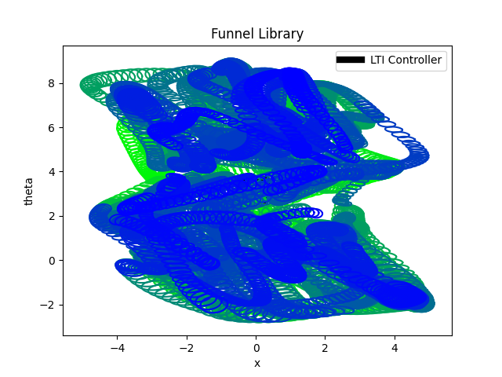

# Modern Control Paradigms - LQR_Trees
LQR-Tree algorithm, which uses locally optimal linear feedback control policies to stabilize planned trajectories computed by local trajectory optimizers, and verification based on a sums-of-squares method to estimate the local regions of stability.

## About 
Here presented main ideas and brief observations about **LQR-Tree** from papers: 

1. [LQR-trees: Feedback Motion Planning via Sums-of-Squares Verification](https://www.researchgate.net/publication220122524_LQR-trees_Feedback_Motion_Planning_via_Sums-of-Squares_Verification)

2. [LQR-Trees: Feedback Motion Planning on Sparse Randomized Trees](https://groups.csail.mit.edu/robotics-center/public_papers/Tedrake09a.pdf)

Also provided implementation of LQR-Trees for experiments on simple pendulum and cart pole. All software referecened to ideas from repos: 

1. [Cart pole and Pendulum experiments](https://github.com/EpicDuckPotato/jubilant-octo-dollop)

2. [SOS](https://github.com/FedericoGirlanda/SOS-bilinear-alternation)

3. [Pendulum experiments](https://github.com/FedericoGirlanda/pendulumExp)

## Description
We know that advances in the direct computation of Lyapunov functions using convex optimization make it possible to efficiently evaluate regions of attraction for smooth nonlinear systems.

The region of attraction of this nonlinear feedback policy is the entire controllable subset of the state space, verifying that all initial conditions that are capable of reaching the goal will reach the goal.

## Introduction
LQR-Tree algorithm operates by growing a tree of stabilized and verified trajectories backwards from a goal state. At each step of the algorithm, a random sample is drawn from a bounded distribution over state space. If that point is already inside the region of attraction of one of the trajectories, then it is discarded. If it is outside, then a local trajectory optimizer attempts to find a new trajectory which connects this random sample to the tree (and therefore to the goal). This new trajectory is stabilized and verified, and then the process repeats.

Capable computing verified feedback policies for complicated nonlinear systems which are not amenable to feedback linearization and with dimensionality beyond what might be accessible to grid-based algorithms like dynamic programming.

The use of local trajectory optimizers and local feedback stabilization scales well to higher dimensions, and reasoning about the feedback regions allows the algorithm to cover a bounded subset of state space which is controllable to the a goal with a relatively sparse set of trajectories. In addition, the algorithms operate directly on the continuous state and action spaces and perform verification algebraically, and thus are not subject to the pitfalls of discretization which limit accuracy and scalability. By considering feedback during the planning process, the resulting plans are robust to disturbances and quite suitable for implementation on real robots.

## Related work
Rather than designing a nonlinear feedback controller directly in the optimization, we rely on classical linear quadratic regulator (LQR) synthesis to design a series of locally-valid controllers and compose these controllers using feedback motion planning. This has the advantage that it may work for hopelessly nonconvex control problems, such as navigation through a **complicated obstacle field**, **robotic manipulation**, or **legged locomotion over rough terrain**, where the randomized motion planning algorithms have demonstrated success.

Region-of-attraction verification for polynomial systems has recently been explored as a search for Lyapunov functions using **sums-of-squares techniques**.

Simulation of the system dynamics can help find good initial guesses for the Lyapunov function.

## Linear Feedback Design and Verification
The **LQR-Tree** algorithm is based on the ability to efficiently design trajectories of the robot through state space, to stabilize those trajectories using linear quadratic regulator (LQR) feedback design, and to estimate the region of attraction of the feedback controller.

## Trajectory Optimization
In order to increase the set of states which can reach the goal beyond the time invariant LQR design, we will design and stabilize a feasible trajectory for the system with an initial condition outside of the verified region of attraction of the time-invariant controller. Trajectory design can be accomplished readily by trajectory optimization algorithms including shooting methods, multiple shooting methods, and direct collocation methods, all of which are quite mature, and can perform well on even very complicated nonlinear systems.


## LQR-Tree Algorithm 
Because both the feedback design and verification work backwards in time, we grow the tree backwards, starting from the goal. The result is that the tree becomes a large web of stabilizing controllers which grab initial conditions and pull them towards the goal. The goal of the algorithm is to cover an entire region of interest, the set of points from which the goal state is reachable, or a specified bounded subset of this region, with this stabilizing controller.

To achieve this, algorithm grows the tree in the fashion of an RRT, where new subgoals are chosen at random from a uniform distribution over the state space. Unlike the RRTs, we have additional information from the estimated regions of stability (funnel), and we can immediately discard sample points which are sampled inside the previously verified region.

## Problems
One consequence of this sampling strategy is that the algorithm which attempts to connect the random sample back to the goal must be capable of establishing this connection over some finite distance through state space. For this reason, we use the trajectory optimization algorithms described briefly.

# Simulations

Solution uses: 

**Ipopt** (Interior Point Optimizer, pronounced "Eye-Pea-Opt") is an open source software package for large-scale nonlinear optimization. It can be used to solve general nonlinear programming problems of the form:

```
   min     f(x)
  x ∈ Rⁿ

s.t.       g_L ≤ g(x) ≤ g_U
           x_L ≤  x   ≤ x_U
```
where ```f(x): Rⁿ --> R``` is the objective function, and ```g(x): Rⁿ --> Rᵐ```
are the constraint functions.  The vectors `g_L` and `g_U` denote the lower and upper bounds on the constraints, and the vectors `x_L` and `x_U` are the bounds on the variables `x`.
The functions `f(x)` and `g(x)` can be nonlinear and nonconvex, but should be twice continuously differentiable.
Note that equality constraints can be formulated in the above formulation by setting the corresponding components of `g_L` and `g_U` to the same value.


## Instalation 

1.  `sudo apt install coinor-libipopt-dev`
2.  `pip3 install cyipopt`

## Experiments 
Run experiments:

`puthon3 test_cartpole.py`

## Results


## References

1. [LQR-trees: Feedback Motion Planning via Sums-of-Squares Verification](https://www.researchgate.net/publication220122524_LQR-trees_Feedback_Motion_Planning_via_Sums-of-Squares_Verification)

2. [LQR-Trees: Feedback Motion Planning on Sparse Randomized Trees](https://groups.csail.mit.edu/robotics-center/public_papers/Tedrake09a.pdf)

3. [Cart pole and Pendulum experiments](https://github.com/EpicDuckPotato/jubilant-octo-dollop)

4. [SOS](https://github.com/FedericoGirlanda/SOS-bilinear-alternation)

5. [Pendulum experiments](https://github.com/FedericoGirlanda/pendulumExp)

6. [IPOPT](https://coin-or.github.io/Ipopt/index.html)